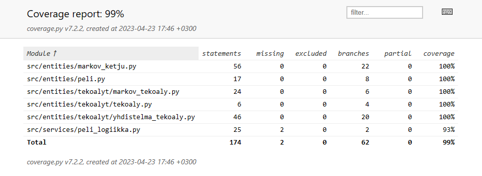
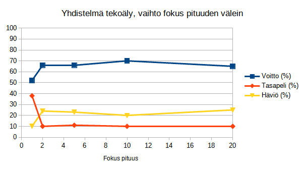
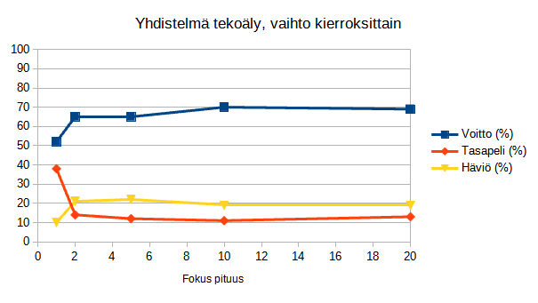

# Testausdokumentti

[](https://codecov.io/gh/TheJiahao/kivi-sakset-paperi-tekoaly)

## Yksikkötestaus



Yksikkötestauksen tarkka kattavuusraportti on nähtävissä Codecovissa klikkaamalla yllä olevaa kuvaketta.

## Tietorakenteet

Markovin ketjua kuvaava `MarkovinKetju`-luokka on testattu yksikkötesteillä.

## Tekoälyt

Markovin ketjun perustuvaa tekoälyä kuvaava `MarkovTekoaly`-luokka on testattu yksikkötesteillä yksinkertaisissa tapauksissa.

Yhdistelmätekoälyä kuvaava `YhdistelmaTekoaly`-luokan yksinkertaiset metodit on testattu yksikkötesteillä.
Lisäksi toimintaa on testattu sännöllisillä syötteillä sekä pidemmällä syötteellä, joka on tuotettu räpläämällä näppäimistöä ja tutkimalla eri pituisten osajonojen frekvenssejä seuraavalla koodilla:

```python
jono = input("Syöte: ")
pituus = int(input("Pituus: "))

jakauma = {}

for i in range(0, len(jono) + 1 - pituus):
    osa = jono[i : i + pituus]

    jakauma[osa] = jakauma.get(osa, 0) + 1

print(len(jono))
l = list(jakauma.items())
print(sorted(l, key=lambda x: x[1], reverse=True))
```

Lisäksi `YhdistelmaTekoaly`-luokka on testattu käsin syötteellä (tuotettu räpläämällä näppäimistöä)
`kspskspkspkpskkspkskspkspkspkskspkspkspskpskpskspkspkspkspskpskspkspskskpskpskpskpskpskspkspkspkspkspskpskpskspkspkspskskksksskpskpskpskspskpspkspkspkspkspkspkpkspkspkskskskkskspskpkskskpspkspkpskskpkskpskpsksp`
Alla on tulokset eri asetuksilla


Testauksen perusteella edellä mainitulla syötteellä tekoälyn voittojen osuus näyttäisi lähestyvän noin 60-70 %, tasapelien noin 10 % ja häviöiden noin 20-30 %.

## Sovelluslogiikka

Pelin toimintaa kuvaava `Peli`-luokka on testattu yksikkötesteillä oletus- eli kivi-sakset-paperi-peliä vastaavilla parametreilla.

Testejä varten on luotu `FakeTekoaly`-luokka.
Luokka vastaa tekoälyä, joka pelaa vuorotellen `k`, `s` ja `p`.

## Käyttöliittymä

Käyttöliittymää kuvaava `UI`-luokka on testattu käsin.

## Testien toistaminen

Testejä on kokeiltu Linux-ympäristössä.
Asenna projekti [käyttöohjeen](kayttoohje.md) mukaan.
Yksikkötestien suorittaminen onnistuu komennolla:

```shell
poetry run invoke test
```
