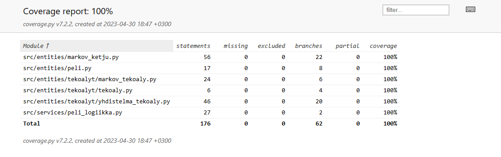

# Testausdokumentti

[](https://codecov.io/gh/TheJiahao/kivi-sakset-paperi-tekoaly)

## Yksikkö- ja integraatiotestaus



Yksikkötestauksen tarkka kattavuusraportti on nähtävissä Codecovissa klikkaamalla yllä olevaa kuvaketta.

### Tietorakenteet

Markovin ketjua kuvaava `MarkovinKetju`-luokka on testattu yksikkötesteillä.

### Tekoälyt

Markovin ketjun perustuvaa tekoälyä kuvaava `MarkovTekoaly`-luokka on testattu yksikkötesteillä yksinkertaisissa tapauksissa.

Yhdistelmätekoälyä kuvaava `YhdistelmaTekoaly`-luokan yksinkertaiset metodit on testattu yksikkötesteillä.
Tekoälyihin liittyvien satunnaisuuden vuoksi `lisaa`- ja `pelaa`-metodit ovat vielä testaamatta.

### Sovelluslogiikka

Pelin toimintaa kuvaava `Peli`-luokka on testattu yksikkötesteillä oletus- eli kivi-sakset-paperi-peliä vastaavilla parametreilla.

### Käyttöliittymä

Käyttöliittymää kuvaava `UI`-luokka on testattu käsin.

## Testien toistaminen

Asenna projekti [käyttöohjeen](kayttoohje.md) mukaan.
Yksikkötestien suorittaminen onnistuu komennolla:

```shell
poetry run invoke test
```
