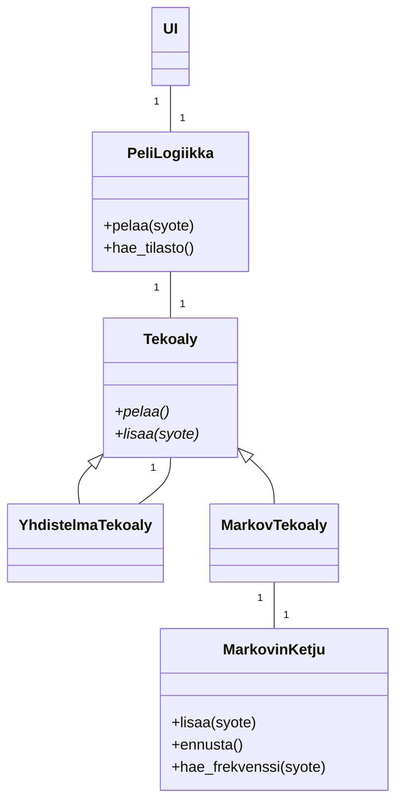

# Toteutusdokumentti

## Ohjelman rakenne

Ohjelman rakenne on esitetty seuraavassa luokkakaaviossa.
Logiikkaan lisätään yksi `Tekoaly`-tyyppinen tekoäly.



## Saavutetut aika- ja tilavaativuudet

### Tietorakenteet

#### `MarkovKetju`

Luokan tilavaativuudet ovat seuraavat:

- $O(n)$-kokoinen jonona toteutettu muisti
- $O(k)$-kokoinen vaihtoehtojen joukko
- $O(k\cdot k^n)$ eli $O(k^{n+1})$-kokoinen siirtymämatriisi (2-ulotteinen hajautustaulu) [^stochasticMatrix]

Koska kyseessä on kivi-sakset-paperi-peli, niin $k=3$.
Huomataan myös, että $k\le k^{n+1}$ kaikilla $n, k\in\mathbb{N}$. Lisäksi koska $k\mapsto k^{n+1}$ kasvaa eksponentiaalisesti, niin voidaan pitää $O(k^{n+1})$ suurempana kuin $O(n)$.
Siis `MarkovKetju`-luokan tilavaativuus on $O(k^{n+1})$.

Keskeisten metodien aikavaativuudet ovat seuraavat:

- `hae_frekvenssi`: $O(n)$, missä $n$ on muistin pituus.
    Pseudokoodi:

    ```python
    # noin O(1), jos hajautusarvon tapahtuu ajassa O(1)
    if syote not in joukko:
        raise Error
    
    # O(n)
    muisti = muunna_tupleksi(muisti) 
    # O(1)
    tulos = frekvenssit[muisti] 
    
    return frekvenssit[muisti]
    ```

- `lisaa`: $O(n)$
    Pseudokoodi:

    ```python
    # O(1)
    if syote not in vaihtoehdot:
        raise ValueError

    # O(n)
    muisti_tuplena = muunna_tupleksi(muisti)

    if len(muisti) == n: # O(1), olettaen, että pituus on erikseen tallennettu
        # Haku O(n), arvon päivittäminen O(1)
        frekvenssit[syote][muisti_tuplena] = hae_frekvenssi(syote) + 1

        # O(1), koska jono
        muisti.lisaa_peraan(syote)
    ```
  
- `ennusta`: $O(nk)$

    Käy läpi $k$-kpl vaihtoehtoja sekä hakee ja vertailee niiden frekvenssiä $O(n)$ ajassa.
    Täten kokonaisuudessaan $O(nk)$-aikavaativuus.

### Tekoälyt

#### `MarkovTekoaly`

Luokka on käytännössä raja-pinta `MarkovKetju`-luokalle, joten myös tila- ja aikavaativuudet ovat vastaavia.
Luokka sisältää lisäksi sanakirjan vaihtoehtoja vastaavista voittavista tapauksista, joka on $O(k)$-kokoinen.
Siis tilavaativuus on sama kuin `MarkovKetju`-luokalla eli $O(k^{n+1})$.

Lisäksi keskeisten metodien aikavaativuudet ovat seuraavat:

- `lisaa`: $O(n)$, perustuu `MarkovKetju`-luokan `lisaa`-metodiin
- `pelaa`: $O(nk)$, perustuu `MarkovKetju`-luokan `ennusta`-metodiin

#### `YhdistelmaTekoaly`

Luokan keskeisten muuttujien tilavaativuudet ovat seuraavat:

- `peli`: `Peli`-olio, $O(k)$
- `tekoalyt`: taulukko, joka sisältää tekoälyjä.
  Oletukseltaan sisältää $m$ kpl `MarkovTekoaly`-olioita (muistien pituuksilla $1$, ..., $m$), missä $m$ kuvaa monenko aiemman pelin perusteella tekoälyt pisteytetään.
  Arvioimalla jokaisen `MarkovTekoaly`-olion tilavaativuutta ylöspäin $O(k^{m+1})$-kokoiseksi saadaan taulukon tilavaativuudeksi $O(mk^{m+1})$.
- `pisteet`: taulukko, joka sisältää tekoälyjen $m$-aikaisemman pelin pisteet $m$-pituisina jonoina.
  Indeksit ovat samat kuin vastaavan tekoälyn indeksi `tekoalyt`-taulukossa.
  Oletukseltaan $O(m^2)$-kokoinen.
- `pelaava_tekoaly`: $O(k^{m+1})$, olettaen, että käytetään vain `MarkovTekoaly`-olioita

Arvioidaan, että $m\le k^{m+1}$, jolloin `tekoalyt`-taulukko vie eniten tilaa ja tilavaativuus kokonaisuudessaan on $O(mk^{m+1})$.

Oletetaan, että kaikki tekoälyt ovat `MarkovTekoaly`-tyyppisiä.
Tällöin keskeisten metodien aikavaativuudet ovat seuraavat:

- `paivita_pisteet`: $O(m^2 k)$
    Pseudokoodi:

    ```python
    # m kpl tekoälyjä oletukseltaan
    for i in range(0, len(tekoalyt)):
        # O(1)
        tekoaly = tekoalyt[i]
        
        # O(mk), arvioidaan ylös päin tekoälyjen muistit m-kokoisiksi
        tekoalyn_siirto = tekoaly.pelaa()

        # O(1)
        tulos = peli.paata_voittaja(tekoalyn_siirto, pelaajan_syote)
        
        # O(1)
        pistejono = pisteet[i]
        # O(1)
        pistejono.append(tulos)
    ```

- `hae_paras_tekoaly`: $O(m^2)$
    Pseudokoodi:

    ```python
    # O(1)
    paras_tekoaly = tekoalyt[0]
    # O(m)
    paras_pisteet = sum(pisteet[0])

    # m kpl tekoälyja oletukseltaan
    for i in range(0, len(tekoalyt)):
        # O(m)
        pisteet = sum(pisteet[i])

        # O(1)
        if pisteet > paras_pisteet:
            paras_tekoaly = tekoalyt[i]
            paras_pisteet = pisteet

    return paras_tekoaly
    ```

- `pelaa`: $O(mk)$, koska käytännössä kutsuu tällä hetkellä pelaavan tekoälyn `pelaa`-metodia.
  Jos on `MarkovTekoaly`, niin $O(mk)$-aikaa kuluu.

- `lisaa`: $O(m^2 k)$
    Pseudokoodi

    ```python
    # O(m^2*k)
    paivita_pisteet(syote)
    siirtoja_jaljella -= 1

    if siirtoja_jaljella == 0:
        # O(m^2)
        pelaava_tekoaly = hae_paras_tekoaly()
        siirtoja_jaljella = m

    # m kpl tekoälyjä oletukseltaan
    for tekoaly in tekoalyt:
        # O(m)
        tekoaly.lisaa(syote)
    ```

### Peli

`Peli`-luokka sisältää joukon kelpaavista vaihtoehdoista sekä sanakirjan niitä voittavista tapauksista.
Koska vaihtoehtoja on $k$ kpl, niin tilavaativuus on $O(k)$.

Luokan keskeisimmän `paata_voittaja`-metodin aikavaativuus on $O(1)$.
Pseudokoodi (`pelaaja1` ja `pelaaja2` ovat pelaajien syötteitä):

```python
# O(1), koska hajautustaulu (joukko)
if pelaaja1 not in vaihtoehdot or pelaaja2 not in vaihtoehdot:
    raise ValueError

tulos = 0

# O(1)
if pelaaja1 != pelaaja2:
    tulos = -1

    # O(1), hajautustaulu
    if voittavat_siirrot[pelaaja2] == pelaaja1:
        tulos = 1

return tulos
```

## Puutteet ja parannusehdotukset

- `YhdistelmaTekoalyssa` voidaan $O(m)$-tilan kustannuksella tallentaa tekoälyjen pisteiden summat ja täten saada `hae_paras_tekoaly`-metodin aikavaativuudeksi $O(m)$.
- `MarkovKetju`-luokassa voisi tehdä jotain muutoksia välttääkseen jonon muuttaminen tupleksi ja yrittää saada se toimimaan $O(1)$-ajassa.

## Lähteet

[^stochasticMatrix]: Wikipedia, Stochastic matrix, 2022, <https://en.wikipedia.org/wiki/Stochastic_matrix>, luettu 23.3.2023
