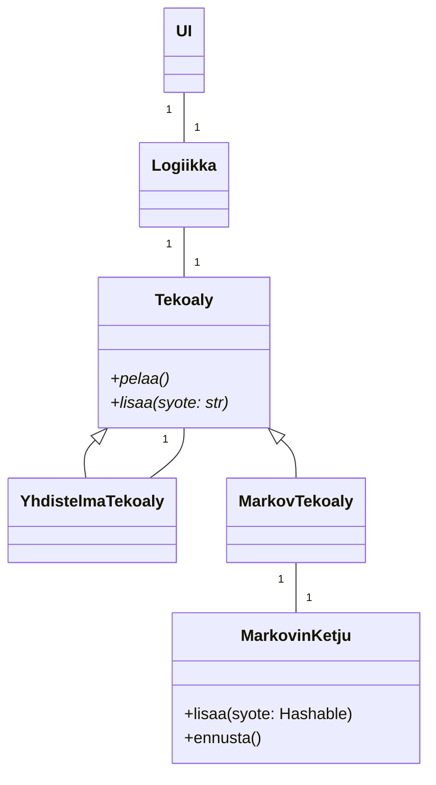

# Toteutusdokumentti

## Ohjelman rakenne

Ohjelman rakenne on esitetty seuraavassa luokkakaaviossa.
Logiikkaan lisätään yksi `Tekoaly`-tyyppinen tekoäly.



## Saavutetut aika- ja tilavaativuudet

### Tietorakenteet

`MarkovKetju`-luokan muisti on toteutettu jonona.
Luokan eniten käytetyt metodit ovat `lisaa` ja `ennusta`
 Keskeisten metodien aikavaativuudet ovat seuraavat:

- `hae_frekvenssi`: $O(m)$, missä $m$ on muistin pituus.
    Pseudokoodi:

    ```python
    # noin O(1), jos hajautusarvon tapahtuu ajassa O(1)
    if syote not in joukko:
        raise Error
    
    # O(m)
    muisti = muunna_tupleksi(muisti) 
    # O(1)
    tulos = frekvenssit[muisti] 
    
    return frekvenssit[muisti]
    ```

- `hae_jonon_frekvenssi`: $O(km)$, missä $k$ vaihtoehtojen määrä.
    Summataan $k$ kpl vaihtoehtojen frekvenssejä yhteen, kun yhden vaihtoehdon haku kestää edellä todetusti $O(m)$.

- `hae_todennakoisyys`: $O(km)$.
    Pseudokoodi:

    ```python
    # O(km)
    if hae_jonon_frekvenssi() == 0:
        return 1 / len(vaihtoehdot)

    # O(m) + O(km) = O(km)
    tulos = hae_frekvenssi(syote) / hae_jonon_frekvenssi()
    
    return tulos
    ```

- `hae_todennakoisyydet`: $O(k^2 m)$, tämä on lähinnä debuggausta varten, ehkä poistan ennen loppupalautusta
    Pseudokoodi:

    ```python
    tulos = sanakirja()

    # O(k^2*m)
    for vaihtoehto in vaihtoehdot:
        # O(km)
        tulos[vaihtoehto] = hae_todennakoisyys(vaihtoehto)

    return tulos
    ```

- `lisaa`: $O(km)$
    Pseudokoodi:

    ```python
    # noin O(1)
    if syote not in vaihtoehdot:
        raise ValueError

    # O(m)
    muisti_tuplena = muunna_tupleksi(muisti)

    # O(km)
    if len(muisti) == n: # O(1), olettaen, että pituus on erikseen tallennettu
        # O(1) + O(km) = O(km)
        frekvenssit[syote][muisti_tuplena] = hae_frekvenssi(syote) + 1

        # O(1), koska muisti on jono
        muisti.lisaa_peraan(syote)
    ```
  
- `ennusta`: $O(km)$

    Pseudokoodi:

    ```python
    # O(1)
    seuraava = joku_vaihtoehto
    
    # O(km)
    for vaihtoehto in vaihtoehdot
        # O(m)
        if hae_frekvenssi(vaihtoehto) > hae_frekvenssi(seuraava):
            seuraava = vaihtoehto

    return seuraava
    ```
