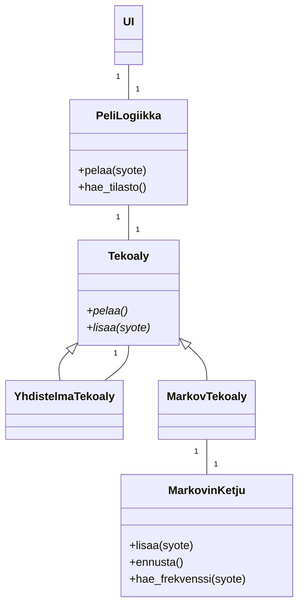

# Toteutusdokumentti

## Ohjelman rakenne

Ohjelman rakenne on esitetty seuraavassa luokkakaaviossa.
Logiikkaan lisätään yksi `Tekoaly`-tyyppinen tekoäly.



## Saavutetut aika- ja tilavaativuudet

### Tietorakenteet

#### `MarkovKetju`

Merkitään vaihtoehtojen määrää $k$ ja muistin kokoa $n$.

Tällöin luokan tilavaativuudet ovat seuraavat:

- $O(n)$, muisti (jono)
- $O(k)$, kuvaus (sanakirja) vaihtoehdoista luvuiksi $\\{0,\dots,k-1\\}$
- $O(k\cdot k^n)$ eli $O(k^{n+1})$-kokoinen siirtymämatriisi (2-ulotteinen hajautustaulu) [^stochasticMatrix]
- $O(1)$, tämän hetkisen jonon hajautusarvo

Koska kyseessä on kivi-sakset-paperi-peli, niin $k=3$.
Huomataan myös, että $k\le k^{n+1}$ kaikilla $n, k\in\mathbb{N}$. Lisäksi koska $k\mapsto k^{n+1}$ kasvaa eksponentiaalisesti, niin voidaan pitää $O(k^{n+1})$ suurempana kuin $O(n)$.
Siis `MarkovKetju`-luokan tilavaativuus on $O(k^{n+1})$.

Keskeisten metodien aikavaativuudet ovat seuraavat:

- `hae_frekvenssi`: $O(1)$

    ```python
    # O(1), hajautustaulu
    if syote not in joukko:
        raise Error
    
    # O(1)
    tulos = siirtymamatriisi[syote][hajautusarvo]
    
    return siirtymamatriisi[hajautusarvo]
    ```

- `lisaa`: $O(1)$

    ```python
    # O(1)
    if syote not in vaihtoehdot:
        raise ValueError

    # O(1), hajautustaulu
    oikea_numero = kuvaa_numeroksi(syote)
    vasen_numero = 0

    if len(muisti) == n: # O(1), olettaen, että pituus on erikseen tallennettu
        # O(1), hajautustaulu
        kasvata_frekvenssia(hajautusarvo)

        vasen_numero = muisti[0]

        # O(1), jono
        muisti.lisaa_peraan(syote)
        muisti.poista_alusta()

        # O(1)
        hajautusarvo *= k
        hajautusarvo += oikea_numero
        hajautusarvo -= vasen_numero * k^n # k^n muistissa O(1)
    ```

- `ennusta`: $O(k)$

    ```python
    seuraava = joku_vaihtoehto
    seuraavan_frekvenssi = joku_frekvenssi

    # O(k)
    for vaihtoehto in vaihtoehdot:
        # O(1)
        if hae_frekvenssi(vaihtoehto) > seuraava:
            seuraava = vaihtoehto
    
    return seuraava
    ```

Luokan toiminta perustuu ideaan, että kuvataan jokainen $n$-pituinen jono $k$-lukujärjestelmän luvuksi.
Alla on tarkempi selitys.

Olkoot $k$-kokoinen vaihtoehtojen joukko $V$ sekä jonojen (muistien) joukko
$$J=\\{(m_1,m_2,\dots,m_n):m_i\in V\quad\text{kaikilla $1\le i\le n$}\\}$$
Joukossa $J$ on tuloperiaatteen nojalla $k^n$ alkiota.

Muodostetaan bijektio (sanakirja) $f\colon V\to\\{0,1,\dots,k-1\\}$.

Muodostetaan toinen funktio $g\colon J\to\\{0,1,\dots,k^n-1\\}$, missä
$$g(m)=\sum_{l=1}^{n}f(m_i)\cdot k^{n-l}=f(m_1)k^{n-1}+f(m_2)k^{n-2}+\dots+f(m_n)k^0$$
Jos esimerkiksi jono $m=a,b,c$, jolle $f(a),f(b),f(c)=0,1,2$
 $0,1,2$, niin $g(m)=012_3$ 3-lukujärjestelmässä.
Nähdään, että myös $g$ on bijektio.

Nyt voidaan esittää algoritmin toiminta.
Olkoon muisti (jono) $m=m_1,m_2,\dots,m_n$.
Kun lisätään muistin $m$ perään uusi jäsen $v\in V$, niin aiempi hajautusarvo $h$ voidaan päivittää $O(1)$-ajassa seuraavalla idealla:

1. Siirretään hajautusarvoa yhden numeron verran vasemmalle eli kerrotaan luvulla $k$, jolloin kohtaa $k^0$ vastaa numero $0$.
2. Korvataan oikeimmainen numero numerolla $f(v)\in\\{0,1,\dots,k-1\\}$, lisäämällä se hajautusarvoon.
3. Poistetaan vasemmainen numero eli kohtaa $k^n$ vastaava numero $f(m_1)$ vähentämällä $f(m_1)\cdot k^n$, jolloin $k^n$ kohdalla on $0$.
4. Nyt hajautusarvo vastaa uutta jonoa $m_2,m_3,\dots,m_n,v$.

### Tekoälyt

#### `MarkovTekoaly`

Luokka on käytännössä raja-pinta `MarkovKetju`-luokalle, joten myös tila- ja aikavaativuudet ovat vastaavia.
Luokka sisältää lisäksi sanakirjan vaihtoehtoja vastaavista voittavista tapauksista, joka on $O(k)$-kokoinen.
Siis tilavaativuus on sama kuin `MarkovKetju`-luokalla eli $O(k^{n+1})$.

Lisäksi keskeisten metodien aikavaativuudet ovat seuraavat:

- `lisaa`: $O(1)$, perustuu `MarkovKetju`-luokan `lisaa`-metodiin
- `pelaa`: $O(k)$, perustuu `MarkovKetju`-luokan `ennusta`-metodiin

#### `YhdistelmaTekoaly`

Luokan keskeisten muuttujien tilavaativuudet ovat seuraavat:

- `peli`: `Peli`-olio, $O(k)$
- `tekoalyt`: taulukko, joka sisältää tekoälyjä.
  Oletukseltaan sisältää $m$ kpl `MarkovTekoaly`-olioita (muistien pituuksilla $1$, ..., $m$), missä $m$ kuvaa monenko aiemman pelin perusteella tekoälyt pisteytetään.
  Arvioimalla jokaisen `MarkovTekoaly`-olion tilavaativuutta ylöspäin $O(k^{m+1})$-kokoiseksi saadaan taulukon tilavaativuudeksi $O(mk^{m+1})$.
- `pisteet`: taulukko, joka sisältää tekoälyjen $m$-aikaisemman pelin pisteet $m$-pituisina jonoina.
  Indeksit ovat samat kuin vastaavan tekoälyn indeksi `tekoalyt`-taulukossa.
  Oletukseltaan $O(m^2)$-kokoinen.
- `pelaava_tekoaly`: $O(k^{m+1})$, olettaen, että käytetään vain `MarkovTekoaly`-olioita

Arvioidaan, että $m\le k^{m+1}$, jolloin `tekoalyt`-taulukko vie eniten tilaa ja tilavaativuus kokonaisuudessaan on $O(mk^{m+1})$.

Oletetaan, että kaikki tekoälyt ovat `MarkovTekoaly`-tyyppisiä.
Tällöin keskeisten metodien aikavaativuudet ovat seuraavat:

- `paivita_pisteet`: $O(mk)$
    Pseudokoodi:

    ```python
    # m kpl tekoälyjä oletukseltaan
    for i in range(0, len(tekoalyt)):
        # O(1)
        tekoaly = tekoalyt[i]
        
        # O(k), oletetaan, että on MarkovTekoaly
        tekoalyn_siirto = tekoaly.pelaa()

        # O(1)
        tulos = peli.paata_voittaja(tekoalyn_siirto, pelaajan_syote)
        
        # O(1)
        pistejono = pisteet[i]
        # O(1)
        pistejono.append(tulos)
    ```

- `hae_paras_tekoaly`: $O(m^2)$
    Pseudokoodi:

    ```python
    # O(1)
    paras_tekoaly = tekoalyt[0]
    # O(m)
    paras_pisteet = sum(pisteet[0])

    # m kpl tekoälyja oletukseltaan
    for i in range(0, len(tekoalyt)):
        # O(m)
        pisteet = sum(pisteet[i])

        # O(1)
        if pisteet > paras_pisteet:
            paras_tekoaly = tekoalyt[i]
            paras_pisteet = pisteet

    return paras_tekoaly
    ```

- `pelaa`: $O(k)$, koska käytännössä kutsuu tällä hetkellä pelaavan tekoälyn `pelaa`-metodia.
  Jos on `MarkovTekoaly`, niin $O(k)$-aikaa kuluu.

- `lisaa`: $O(m^2)$
    Oletetaan, että $3=k\le m$.

    ```python
    # O(mk)
    paivita_pisteet(syote)
    siirtoja_jaljella -= 1

    if siirtoja_jaljella == 0:
        # O(m^2)
        pelaava_tekoaly = hae_paras_tekoaly()
        siirtoja_jaljella = m

    # O(m), m kpl tekoälyjä oletukseltaan
    for tekoaly in tekoalyt:
        # O(1)
        tekoaly.lisaa(syote)
    ```

### Peli

`Peli`-luokka sisältää joukon kelpaavista vaihtoehdoista sekä sanakirjan niitä voittavista tapauksista.
Koska vaihtoehtoja on $k$ kpl, niin tilavaativuus on $O(k)$.

Luokan keskeisimmän `paata_voittaja`-metodin aikavaativuus on $O(1)$.
Pseudokoodi (`pelaaja1` ja `pelaaja2` ovat pelaajien syötteitä):

```python
# O(1), koska hajautustaulu (joukko)
if pelaaja1 not in vaihtoehdot or pelaaja2 not in vaihtoehdot:
    raise ValueError

tulos = 0

# O(1)
if pelaaja1 != pelaaja2:
    tulos = -1

    # O(1), hajautustaulu
    if voittavat_siirrot[pelaaja2] == pelaaja1:
        tulos = 1

return tulos
```

## Puutteet ja parannusehdotukset

- `YhdistelmaTekoalyssa` voidaan $O(m)$-tilan kustannuksella tallentaa tekoälyjen pisteiden summat ja täten saada `hae_paras_tekoaly`-metodin aikavaativuudeksi $O(m)$.

## Lähteet

[^stochasticMatrix]: Wikipedia, Stochastic matrix, 2022, <https://en.wikipedia.org/wiki/Stochastic_matrix>, luettu 23.3.2023
